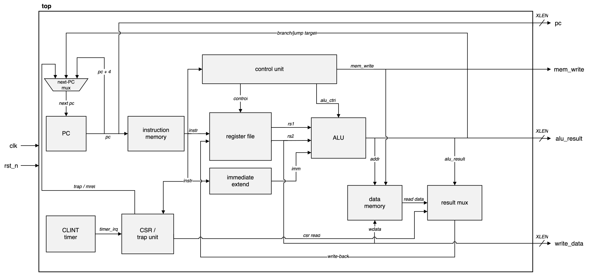
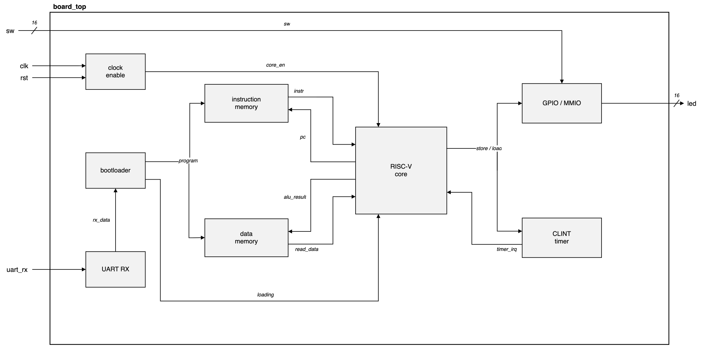

# riscv-single-cycle

[](https://github.com/drewbabel/riscv-single-cycle/actions/workflows/ci.yml)

A single-cycle RV32I processor in SystemVerilog that boots FreeRTOS on a Digilent Basys 3, with:

- One instruction per clock, with the `pc` register, register file, data memory, CSR file, and timer as the only sequential state.
- Zicsr control registers, machine-mode traps, and a core-local timer that redirects the next-PC multiplexer ahead of any branch or sequential fetch.
- Word-organized data memory serving byte, halfword, and word accesses through per-byte write strobes and a load-extend stage.
- A serial bootloader that streams a program over UART into instruction and data memory, releasing the core without re-synthesis.
- A two-task FreeRTOS demo scheduled from the `clint` tick, passing switch patterns through a kernel queue to drive the LEDs.



## Verification

| Method | Scope |
|--------|-------|
| riscv-formal under SymbiYosys | Every retired instruction against RV32I, machine-mode traps, Zicsr, misaligned access |
| SymbiYosys unit proofs | `csr` interrupt path by k-induction, exhaustive `alu` proof against a reference model |
| Spike lockstep co-simulation | Register and memory write of every retired instruction, directed and randomized programs |
| Reference-model testbenches | Every module, plus directed trap sequences through `csr`, `clint`, and the timer |
| Basys 3 | FreeRTOS demo driving the trap, timer, and byte-lane memory paths on hardware |

The riscv-formal wrapper ties the timer interrupt low, and `formal/irq.sby` proves the trap logic separately. An interrupt is taken only when pending and enabled, never while masked, a simultaneous exception outranks it, and `mret` restores `MIE` from `MPIE`. The randomized generator feeds the same lockstep check with byte, halfword, and word accesses, reaching sequences the directed programs miss.

## Performance

CoreMark links against the libgcc soft-multiply routines, since the base integer core carries no hardware multiplier.

| Configuration | Cycles/iteration | Iterations/sec | CoreMark/MHz |
|---------------|------------------|----------------|--------------|
| Simulation | 718,010 | | 1.39 |
| Basys 3, 3.125 MHz core | 718,010 | 4.35 | 1.39 |

## System-on-chip

`board_top` wraps `riscv_single` for the Basys 3. Instruction fetch and data access run on separate block RAMs, and the core steps once every 32 memory clocks through a clock enable, so the fast memory serves a fetch and a dependent load inside one core cycle.



| Region | Address | Access |
|--------|---------|--------|
| LEDs | `0x0300_0000` | read + write |
| Switches | `0x0300_0004` | read |
| CLINT `mtime` and `mtimecmp` | `0x0200_xxxx` | read + write |
| UART transmit data | `0x0400_0000` | write |
| UART transmit ready | `0x0400_0004` | read |

## Implementation

Synthesized for the Xilinx Artix-7 XC7A35T through sv2v, Yosys, and nextpnr-xilinx.

| Module | LUTs | Flip-flops |
|--------|------|------------|
| `pc` | 0 | 32 |
| `alu_decoder` | 5 | 0 |
| `control_unit` | 24 | 0 |
| `control_decoder` | 30 | 0 |
| `extend` | 31 | 0 |
| `clint` | 219 | 128 |
| `alu` | 497 | 0 |
| `csr` | 845 | 383 |
| `regfile` | 911 | 992 |
| `riscv_single` | 2805 | 1416 |

## Building and running

```
make MOD=alu                                # run a module's testbench
make wave MOD=alu                           # run the testbench and open the waveform in Surfer
make formal MOD=alu                         # run the module's SymbiYosys proof
make trace MOD=alu                          # print a formal counterexample as text
make view-formal MOD=alu                    # open a formal waveform in Surfer
bash formal/rvfi/run.sh                     # run the full riscv-formal proof of the core
make hex PROG=program                       # assemble tests/program.s to a hex image
make cosim PROG=cosim1                      # lockstep-compare a program against Spike
python3 tests/send_prog.py PORT prog.hex    # stream a program to the board over UART
python3 tests/monitor.py PORT               # print the board's serial output
make -C sw/coremark all                     # build the CoreMark image
./synth_stats.sh riscv_single               # report a module's synthesis cost
```

### Tool versions

Icarus Verilog 13.0, Yosys 0.66, SymbiYosys 0.66 with Yices 2, sv2v 0.0.13, the RISC-V GNU toolchain (`riscv64-elf-gcc` 16.1.0), Spike 1.1.1, Python 3.11, and Surfer.
